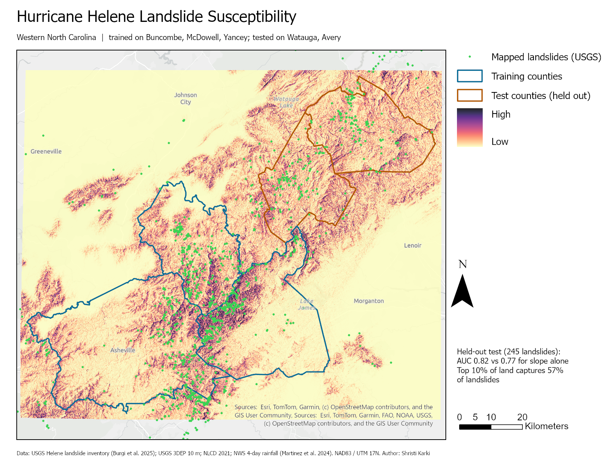
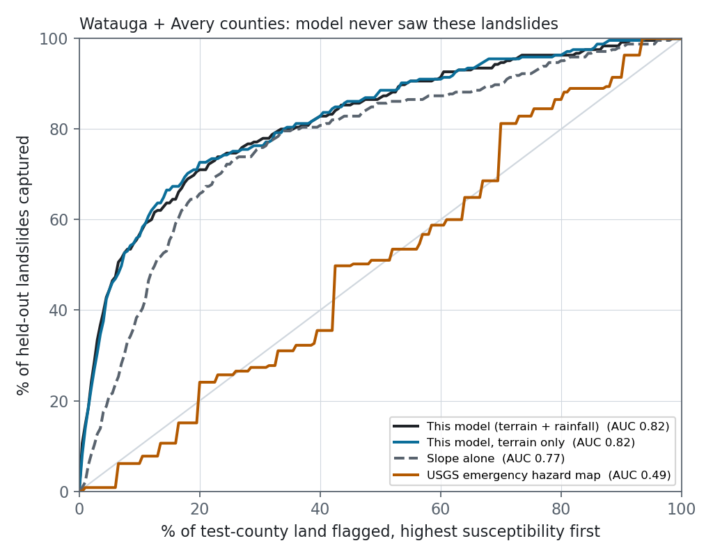

# Hurricane Helene Landslide Susceptibility 

Hurricane Helene dropped up to 32 inches of rain on western North Carolina in
September 2024 and set off more than 2,000 landslides. This project builds an
ArcGIS Pro **Python toolbox** (`HeleneLandslide.pyt`) that turns public USGS
elevation, land cover and rainfall data into a 30 m landslide susceptibility
map. The model is trained on three counties and then **tested on two counties
it never saw**.



## Result

Trained on 723 mapped landslides in Buncombe, McDowell and Yancey counties, and
scored on 245 landslides in **Watauga and Avery counties**, which were held out:

| Surface scored in the test counties | AUC (95% CI) | Landslides in top 5% of land | in top 10% | in top 20% |
|---|---|---|---|---|
| **This model, terrain + rainfall** | **0.82** (0.79–0.84) | **44.5%** | **56.7%** | 71.0% |
| This model, terrain only | 0.82 (0.79–0.85) | 44.5% | 56.3% | 72.7% |
| Slope alone (baseline) | 0.77 (0.74–0.80) | 20.8% | 39.2% | 65.7% |
| USGS emergency hazard map (~7 km cells) | 0.50 (0.46–0.53) | 0.8% | 6.1% | 24.1% |



What these numbers show:

- **The model carries over to new counties.** AUC falls from 0.91 on the
  training counties to 0.82 on the held-out ones. That drop is the honest
  measure of the model; the training-county score is not.
- **It roughly doubles the hit rate of slope alone where it matters.** If an
  emergency manager can inspect only 5% of the land, this map puts 44.5% of the
  landslides inside that 5%. Ranking by slope alone puts 20.8% there.
- **Rainfall did not help inside the test counties** (AUC 0.819 with it, 0.822
  without). Rainfall controls *which region* fails. Within a county, where a
  slope fails is mostly set by terrain: relief, slope and hollows that collect
  water. Rainfall is still in the main model because it is part of the
  physics, and the terrain-only result is reported alongside it.
- **This is not a claim of beating the USGS.** The USGS emergency map was built
  in days for regional triage, and at that scale it works well. Across the
  whole five-state inventory area it scores **AUC 0.92** (0.91–0.92; see
  `scripts/usgs_regional_check.py`). Inside two counties, its ~7 km cells give
  only a few dozen distinct values, so it cannot rank one hillside against the
  next. The two maps answer questions at different scales.

## The toolbox

Open `HeleneLandslide.pyt` in the ArcGIS Pro Catalog pane, or call it from Python:

| Tool | What it does |
|---|---|
| **1. Build Terrain Factors** | Mosaics 3DEP 10 m tiles, clips them to the study area, projects to UTM 17N, then derives 11 rasters at 30 m: elevation, slope (computed at 10 m and averaged), 90 m relief, northness/eastness, plan and profile curvature, topographic wetness index, distance to streams (from a flow-accumulation stream network), grouped NLCD land cover and NWS 4-day rainfall. Each layer is saved as it finishes, so an interrupted run resumes instead of starting over. |
| **2. Train Susceptibility Model** | Wraps Esri's *Presence-only Prediction (MaxEnt)*: landslides plus 10,000 random background points, 90 m spatial thinning, linear/quadratic/hinge features, and 3-fold cross-validation. Predicts over the full extent. |
| **3. Evaluate Susceptibility** | Scores any number of rasters on held-out points: AUC with a bootstrap 95% CI, plus the share of landslides captured by the top 5/10/20% of land. |

```python
arcpy.ImportToolbox(r"HeleneLandslide.pyt", "helene")
arcpy.helene.EvaluateSusceptibility("suscep_full;slope", "ls_headscarp",
                                    "test_counties", 20000, "eval.csv")
```

The tools include parameter validation (for example, cell size must be 10–100 m),
filtered inputs (point vs polygon layers), and multi-value factor selection.
That makes the toolbox reusable for any landslide inventory, not only Helene.

## Design choices worth defending

- **Spatial hold-out rather than a random split.** Random train/test points
  from the same valleys share terrain, which inflates scores. Holding out
  whole counties means every test landslide sits on ridges and in watersheds
  the model never trained on.
- **Only Sentinel-2 points (1,595 of 2,217).** USGS placed emergency points at
  the *impact* (the road, river or house). In review, only landslides visible
  in Sentinel-2 imagery were moved back to the headscarp where the slope
  failed. Training on impact points would teach the model where roads are.
- **No distance-to-roads factor**, for the same reason. Road cuts do cause
  landslides, but this inventory cannot separate that effect from where
  mappers placed the points.
- **Slope at 10 m, model at 30 m.** Averaging 10 m slope keeps the short,
  steep hollows that a 30 m DEM smooths away. A 30 m grid also matches the
  "within tens of meters" positional accuracy USGS gives for the points.

## Limitations

- The inventory is preliminary and points-only (no landslide outlines). It
  under-counts small slides under forest canopy.
- There is no soil-depth or geology layer. Both matter for debris flows in the
  Blue Ridge and would be the next factors to add (SSURGO, NCGS geology).
- MaxEnt output is *relative* susceptibility for this storm, not an annual
  probability.

## Reproduce

Requires ArcGIS Pro 3.x with Spatial Analyst. Inputs total about 2 GB and are
all public.

```bash
bash scripts/download_data.sh                               # USGS, MRLC, Census
propy scripts/run_pipeline.py prep                          # counties + landslide points
propy scripts/run_pipeline.py factors                       # ~10 min
propy scripts/run_pipeline.py train                         # ~5 min per model
propy scripts/run_pipeline.py evaluate                      # -> outputs/evaluation_test_counties.csv
propy scripts/usgs_regional_check.py
propy scripts/make_figures.py && propy scripts/make_aprx.py # figures + HeleneLandslide.aprx layout
python -m pytest tests                                      # metric unit tests, no ArcGIS needed
```

`propy` is `C:\Program Files\ArcGIS\Pro\bin\Python\Scripts\propy.bat`.

## Data

- Burgi, P.M., et al., 2025, *Preliminary Landslide Inventory for Landslides
  Triggered by Hurricane Helene (September 2024)*: USGS data release,
  <https://doi.org/10.5066/P14CHGKS>
- Martinez, S.N., et al., 2024, *Preliminary Landslide Hazard Models for the
  2024 Hurricane Helene Landslide Emergency Response*: USGS data release,
  <https://doi.org/10.5066/P134ERB9> (NWS rainfall and the USGS hazard map)
- USGS 3D Elevation Program, 1/3 arc-second DEM
- MRLC, NLCD 2021 Land Cover
- U.S. Census Bureau, 2023 cartographic boundary files
